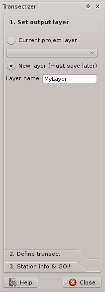
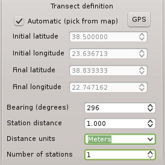
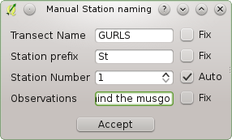

Transectizer
============

Transectizer es un plugin QGIS que facilita una manera sencilla para diseñar transectos lineales con estaciones de muestreo distribuidas a una distancia determinada a lo largo del transecto.

Transectizer hace posible generar automáticamente los detalles de cada estación individual (nombre del transecto/campaña, nombre de la estación, número de estación) o tener control sobre todos los atributos de cada estación.

Puede almacenar los transectos en una nueva capa o proporcionar una capa existente. En ese caso, Transectizer  hará los cambios apropiados en la capa para hacerla compatible con Transectizer.

Copyright/License
=================

Transectizer ha sido desarrollado por Jorge Tornero.

(C) 2013, 2014 Jorge Tornero, http://imasdemase.com

Transectizer se libera bajo los términos de la 

**GNU GENERAL PUBLIC LICENSE**

Version 3, 29 June 2007

This program is free software: you can redistribute it and/or modify it under the terms of the GNU General Public License as published by the Free Software Foundation, either version 3 of the License, or (at your option) any later version.

This program is distributed in the hope that it will be useful, but WITHOUT ANY WARRANTY; without even the implied warranty of MERCHANTABILITY or FITNESS FOR A PARTICULAR PURPOSE. See the GNU General Public License for more details.

You should have received a copy of the GNU General Public License along with this program. If not, see:

**http://www.gnu.org/licenses**

Donaciones/cuotas
=================

No se requiere, por supuesto, de cuota o donación ninguna para que Transectizer funcione... si, no obstante, siente que Transectizer ha mejorado algún aspecto de tu vida, puede hacer una pequeña donación a la ONG de su elección para celebrarlo.

Si, además, se siente realmente con ganas de recompensar mi esfuerzo, envíeme una postal desde donde viva. Me sentiré orgulloso de mostrársela a mi crío.

Uso
===

La operación básica de Transectizer es simple: Escoja una capa vectorial de puntos sobre la que operar, defina la línea del transecto, establezca la distancia entre las estaciones que ubicarán y su número y ¡¡listo!! Transectizer añadirá cada estación como un nuevo objeto en su capa.

Escogiendo la capa de trabajo
-----------------------------

Esta parte del diálogo principal de Transectizer es auto-explicativa, pero existen algunos detalles a tener en cuenta:

1) Al escoger una capa existente, Transectizer comprobará si la capa escogida tiene los atributos que necesita Transectizer para funcionar:

- Un campo *survey* de tipo cadena y longitud 20.
- Un campo *station* de tipo cadena y longitud 20.
- Un campo *stnnum* de tipo entero.
- Un campo *stnlat* de tipo double.
- Un campo *stnlon* de tipo double. 
- Un campo *stnobs* de tipo cadena y longitud 254.

Si la capa escogida no tiene esos atributos, será preguntado si desea crearlas dentro de su capa o cancelar la operación.

2) Al crear una capa nueva, será creada como una capa de memoria, por lo que es obligatorio guardarla a fichero si desea conservar la información.

Definición del transecto
------------------------

Esta parte del diálogo hace posible definir la línea a lo largo de la cual se ubicarán las estaciones (¡¡Síiii, eso es el transecto!!)

El transecto se definde facilitando un punto inicial, un rumbo para la línea y una distancia entre estaciones. A estos efectos, Transectizer dispone de dos modos de operación:

**1) Definición de transecto automática:** Haga click sobre el mapa y arrastre el ratón. EL click inicial define el punto inicial del transecto y un segundo punto del transecto se define al soltar el botón del ratón. En ese momento, Transectizer calcula el rumbo del transecto para Usted.
**2) Definición de transecto manual:** Debe facilitar, o bien un punto inicial y otro final para el transecto (en cuyo caso Transectizer calculará el rumbo del transecto resultante) o simplemente el punto inicial del transecto y el rumbo en grados.

**En ambos casos, debe proporcionar las coordenadas de los puntos en el mismo SRC que el proyecto**

Después de definir la línea, debe proporcionar la distancia entre estaciones en las unidades escogidas en el combobox de unidades y el número de estaciones a ser ubicadas.

Detalles de estación
--------------------

Cada una de las estaciones ubicadas tendrá información asociada. Una capa habilitada para trabajar con Transectizer tiene ciertos atributos (ver *Escogiendo la capa* más arriba) Transectizer tiene dos modos de operación que proporcionan al usuario cierto control y personalización sobre la información almacenada junto a las estaciones.

**1) Detalles de estación automáticos:** Con este modo de operación, puede proporcionar una nombre de estación/campaña y un prefijo de estación fijos, así como un número inicial de estación, que será incrementado secuencialmente.
**2) Detalles de estación manuales:** Cuando se esté creando el transecto, se le ofrecerá un diálogo como este:

Aquí dispone de total control sobre los atributos de la estación. Puede personalizar el nombre de campaña/transecto, el prefijo de estación, el número de estación y las observaciones para cada una de las estaciones generadas. Puede fijar estas variables a su elección e incluso hacer el número de estación secuencial si lo desea.

**¡¡¡Recuerde que este diálogo se creará para cada una y todas las estaciones que genere, de manera que si usted diseña un transecto con un número de estaciones relativamente alto, esto muede ser muy tedioso!!!**

Creando el transecto
--------------------

Una vez que haya seguido los pasos anteriores, debe presionar sobre *Crear nuevo transecto* para crear un nuevo transecto en la capa que ha seleccionado anteriormente.

Puede crear tantos transectos como desee en la misma capa. Una vez finalizado la creación de transectos, debe presionar el boton *Listo* para salir del diálogo de Transectizer

